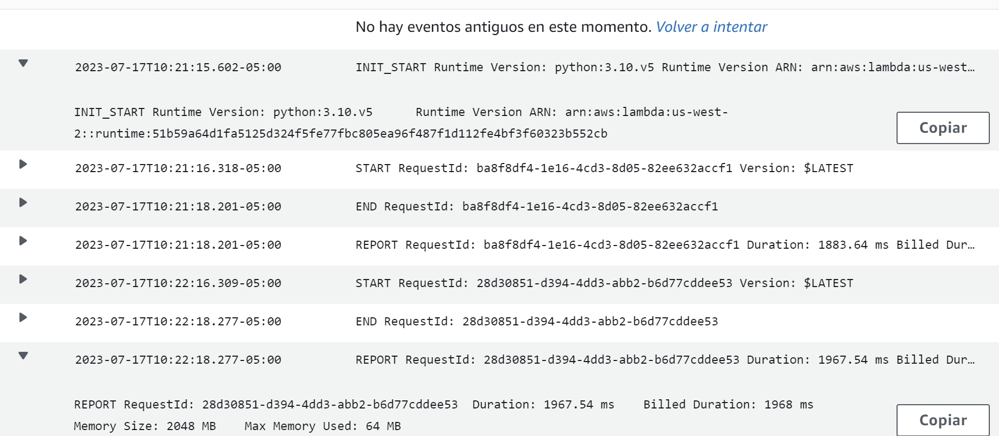
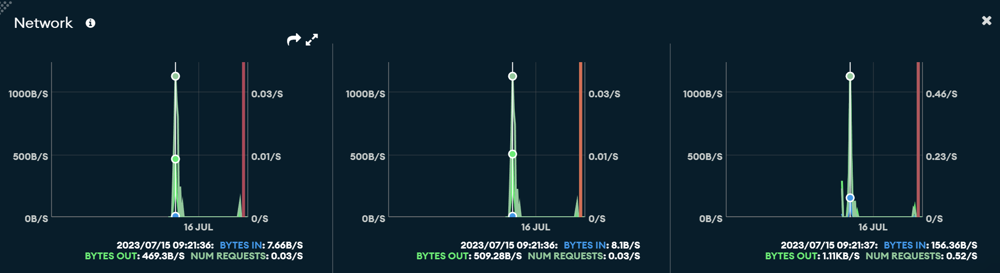

# cloud-computing-project-playlatam

## Conda environment
Create the conda environment with the environment.yml file

```shell
conda env create -f environment.yml
conda activate playlatam-pokemon-vgc
```

## Requirements
Install the requirements with pip

```shell
pip install -r src/requirements.txt
```

## Setup selenium on wsl

Follow this tutorial: https://www.gregbrisebois.com/posts/chromedriver-in-wsl2/


## Pre-commit

After you have installed the requirements.txt with pip.
To generate the git hooks, you must run the following:

```shell
pre-commit install  # installs .git/hooks/pre-commit
pre-commit install --hook-type pre-push  # installs .git/hooks/pre-push
```

## Lambda function (serverless)
Test it locally
```shell
serverless invoke local --function extract_data_from_playlatam
```

Deploy the lambda function with serverless
```shell
serverless deploy
```


## Scraping

```shell
python src/main.py
```

## Cloudwatch (monitoreo)
Monitoreo de cloudwatch a las Lambdas. En esta primera imagen se pueden observar los distintos flujos con start y end de la lambda get tournament data. Un aspecto de mejora es la memoria usada, ya que solo se utilizaron 64 MB. En un inicio no estábamos seguros de cuánto iba a necesitar, por lo que en el .yml le pusimos que el max memory size sea de 2048 MB. Esto claramente es demasiado y se puede reducir para que se use solo lo necesario para optimizar mejor los recursos. Las otras lambdas con api gateway de GET tienen resultados bastantes similares en cuanto a tiempo de ejecución y memoria.



## MongoDB (cloud storage)
Gráfico de métricas de Network, donde se pueden apreciar los bytes out, número de requests y bytes in. En este caso se ha intentado reducir al máximo el número de requests a MongoDB por uso de funciones como insert_many. Asimismo, de todos los bytes hay muy pocos que terminan ingresando a la base de datos porque pasa por un proceso de filtrado de los datos scrapeados, donde solo se insertan los relevantes para el estudio. Se pueden apreciar los picos cuando hay descargas por la lambda versus cuando no se hace ninguna inserción.


